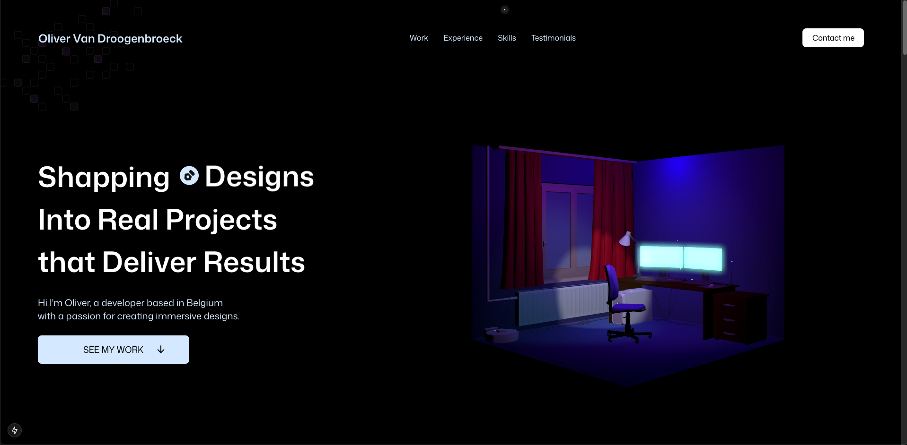

# 🌟 Oliver Van Droogenbroeck - Portfolio Website

<div align="center">
  
  
  **A modern, interactive portfolio showcasing web development expertise**
  
  [](https://olivervdb.com)
  [](https://nextjs.org/)
  [](https://www.typescriptlang.org/)
  [](https://tailwindcss.com/)
</div>

---

## 👋 About

Welcome to my portfolio website! I'm **Oliver Van Droogenbroeck**, a passionate web developer based in Belgium. This project represents not just my work, but my journey in creating immersive, modern web experiences.

The portfolio features interactive 3D elements, smooth animations, and a responsive design that adapts beautifully to any device. It's built with cutting-edge technologies and serves as both a showcase of my projects and a demonstration of my technical skills.

## ✨ Features

- 🎨 **Interactive 3D Models** - Powered by Three.js for engaging visual experiences
- 🎬 **Smooth Animations** - GSAP-powered transitions and micro-interactions
- 📱 **Fully Responsive** - Optimized for desktop, tablet, and mobile devices
- 🌍 **Multilingual Support** - Available in English and French
- 🎭 **Dark Theme** - Modern, elegant dark design with glowing accents
- ⚡ **Performance Optimized** - Fast loading times and smooth user experience
- 🔍 **SEO Friendly** - Optimized for search engines with structured data
- 📧 **Contact Integration** - Functional contact form for client inquiries

## 🛠️ Tech Stack

<div align="center">

| Frontend | Styling | Animation | 3D Graphics | Tools |
|----------|---------|-----------|-------------|-------|
|  |  |  |  |  |
| React 18 | CSS3 | Framer Motion | WebGL | ESLint |
| TypeScript | Responsive Design | CSS Animations | 3D Models | Prettier |

</div>

### Core Technologies

- **[Next.js 14](https://nextjs.org/)** - React framework with App Router, SSR, and optimization features
- **[Tailwind CSS](https://tailwindcss.com/)** - Utility-first CSS framework for rapid UI development
- **[Three.js](https://threejs.org/)** - 3D graphics library for interactive models and animations
- **[GSAP](https://greensock.com/gsap/)** - Professional-grade animation library for smooth transitions

## 🚀 Quick Start

### Prerequisites

- Node.js 18+ 
- npm or yarn package manager

### Installation

1. **Clone the repository**
   ```bash
   git clone https://github.com/OliWebDevO/3d_portfolio_nextjs.git
   cd 3d_portfolio_nextjs
   ```

2. **Install dependencies**
   ```bash
   npm install
   # or
   yarn install
   ```

3. **Run the development server**
   ```bash
   npm run dev
   # or
   yarn dev
   ```

4. **Open your browser**
   
   Navigate to [http://localhost:3000](http://localhost:3000) to view the portfolio.

## 📁 Project Structure

```
├── app/                    # Next.js App Router
│   ├── globals.css        # Global styles and animations
│   ├── layout.tsx         # Root layout with SEO metadata
│   └── page.tsx           # Home page component
├── components/            # Reusable UI components
│   ├── models/           # 3D model components
│   │   ├── HeroModels/   # Hero section 3D elements
│   │   └── MaterialUiSlider/ # Interactive project slider
│   ├── Button.tsx        # Custom button component
│   ├── NavBar.tsx        # Navigation component
│   └── ...               # Other UI components
├── sections/             # Page sections
│   ├── Hero.tsx          # Hero section with 3D models
│   ├── ProjectHero.tsx   # Project showcase
│   ├── Contact.tsx       # Contact form
│   └── ...               # Other sections
├── constants/            # Static data and translations
├── contexts/             # React contexts (Language, etc.)
├── hooks/                # Custom React hooks
└── public/               # Static assets
    ├── images/           # Image assets
    └── models/           # 3D model files
```

## 🎯 Key Sections

- **Hero** - Interactive introduction with animated 3D models
- **Projects** - Showcase of web development projects with live demos
- **Skills** - Technical expertise and tools
- **Experience** - Professional background and journey
- **Tech Stack** - Technologies and frameworks used
- **Contact** - Get in touch form and social links

## 🌐 Deployment

This portfolio is deployed on [Vercel](https://vercel.com/) with automatic deployments from the main branch.

For your own deployment:

1. Fork this repository
2. Connect your Vercel account
3. Import the project
4. Deploy with zero configuration

## 📧 Contact

Feel free to reach out for collaborations or opportunities!

- **Website**: [olivervdb.com](https://olivervdb.com)
- **LinkedIn**: [Oliver Van Droogenbroeck](https://www.linkedin.com/in/oliver-van-droogenbroeck-44b699151/)
- **GitHub**: [@OliWebDevO](https://github.com/OliWebDevO)

---

<div align="center">
  <p>⭐ If you found this project interesting, please give it a star!</p>
  <p>🔗 <strong>Live Demo:</strong> <a href="https://olivervdb.com">olivervdb.com</a></p>
</div>

---

*This portfolio is continuously evolving with new projects and improvements. Stay tuned for updates!*
